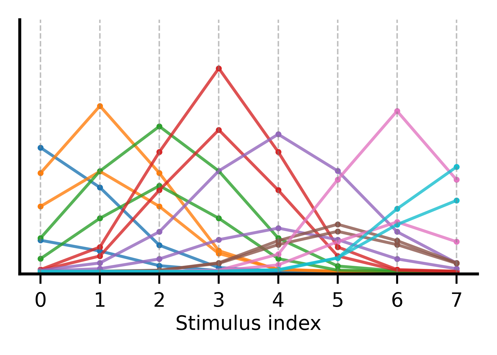
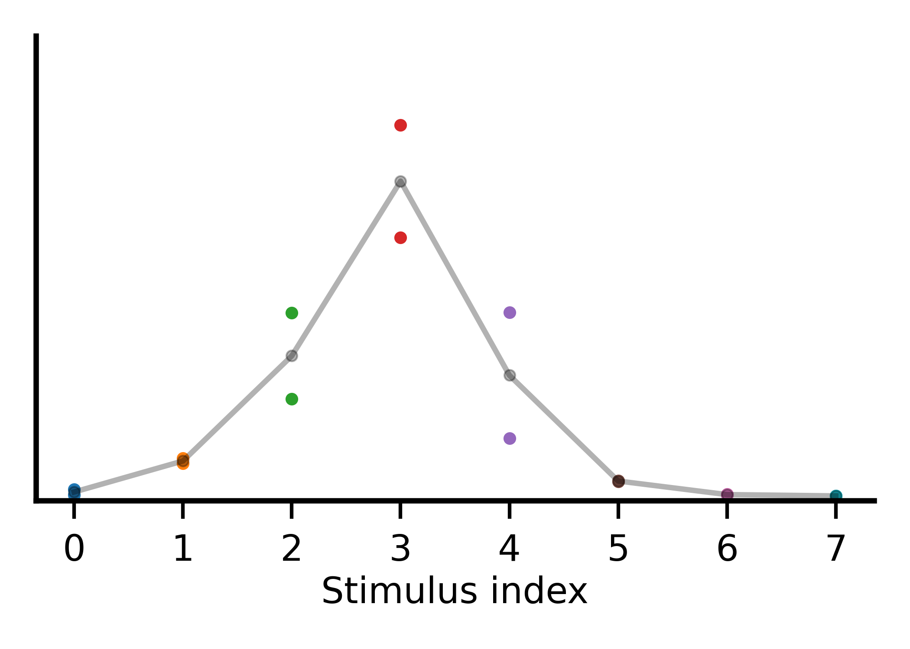
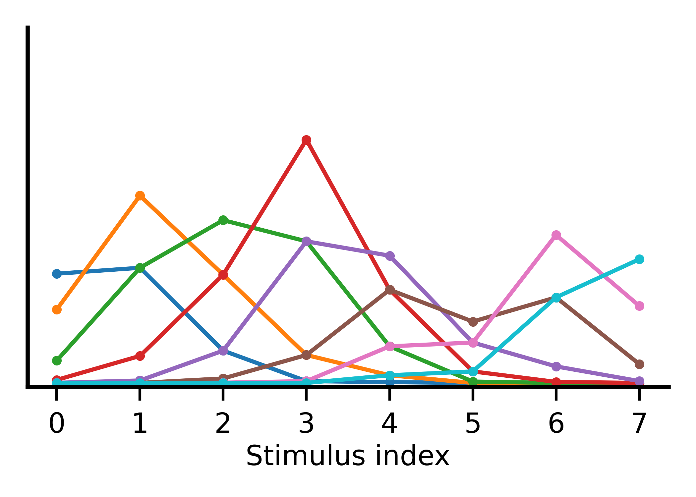

# Population Response Curve

a
A population response curve in neuroscience represents the collective neural responses  of a group of neurons plotted against varying stimulus conditions, illustrating how the overall neural population responds to different inputs (Dayan and Abbot [^1]). Understanding population response curves is crucial for deciphering how neural circuits process information and respond to external stimuli, providing insights into the functioning of the nervous system. 

[^1]: Dayan, Peter, and Abbott, L. F.. Theoretical Neuroscience: Computational and Mathematical Modeling of Neural Systems. United Kingdom, MIT Press, 2001.

### Short illustration

Fig. 1 indicates a population of tuning curves, each depicting the selectivity of a neuron. For illustration, two neurons per stimulus are shown. 

<figure style="text-align: center;">
<p align='center'>

</p>
<figcaption> Figure 1. Population of tuning curves </figcaption>
</figure> 

Fig. 2 shows a population response curve when the stimulus index is 3.

<figure>
<p align='center'>

</p>
<figcaption> Figure 2. Population response curve for stimulus 3 </figcaption>
</figure>

Fig. 3 shows a family of population response curves, one for each stimulus.

<figure>
<p align='center'>

</p>
<figcaption> Figure 3. Family of population response curves </figcaption>
</figure>

The above figures are produced using the script `codes\Illustrator.py`. Feel free to increase the number of neurons per stimulus and plot the population responses.


###  Population Response Curve based Decoding of Mean Direction using Mouse Calcium Imaging Data
This repository contains Python code for obtaining population response curves from preprocessed and epoched calcium imaging data.
 

### Instruction for running the code

1. git clone the repository to a local folder in your computer

2. Change into the 'scripts' folder and set the following paths in the 	'pop_decoding.py' file:

	a. data_path: This is the path where the preprocessed calcium data is stored. 
	b. pval_pref_path: Path to the CSV files where the p-values of the tuned and untuned neurons, as well as the preferred direction of each neuron, are stored."

	In our case, the csv file is in the following format
	
	| Sub	   | Condition| Group    | Pvalue	|Preference|
	|----------|----------|----------|----------|----------|
	| Animal.1 | V1 45	  | Homo     | 0.004    | 5        |
	| Animal.9 | PPC 135  | Hetero   | 0.09     |  1       |
	| ...      | ...      | ...      | ...      | ...      |

	If you have a CSV file with different column names, you may need to adjust the script inside the 'pop_decoding.py' file

	The directory structure with two levels of data will look like this:

	```
	├── passive
	│   ├── PPC_135
	│   ├── PPC_45
	│   ├── PPC_90
	│   ├── V1_135
	│   ├── V1_45
	│   └── V1_90
	├── pvals
	│   ├── task_PPC_135.mat
	│   ├── task_PPC_45.mat
	│   ├── task_PPC_90.mat
	│   ├── task_V1_135.mat
	│   ├── task_V1_45.mat
	│   └── task_V1_90.mat
	└── task
	    ├── PPC_135
	    ├── PPC_45
	    ├── PPC_90
	    ├── V1_135
	    ├── V1_45
	    └── V1_90

	```
3. Run the 'pop_decoding.py' script; it will create a 'decoding' folder (this is the results folder) at the same level as the 'scripts' folder. The structure of the 'decoding' folder would be the following:

```
.
├── plots
│   ├── montages
│   ├── task_V1_45_10.png
│   ├── task_V1_45_20.png
│   ├──        . 
│   ├──        .  
│   └── task_PPC_135_100.png
├── slopes
│   └── task
│   └── passive
└── tuning_curves
    ├── passive
    └── task
```
4. Individual figures for each condition are stored inside the 'plots' directory.

> Note: The 'Montage' folder (that contains stitched figure files) will be recreated only if the platform is Linux (if Montage is installed).
